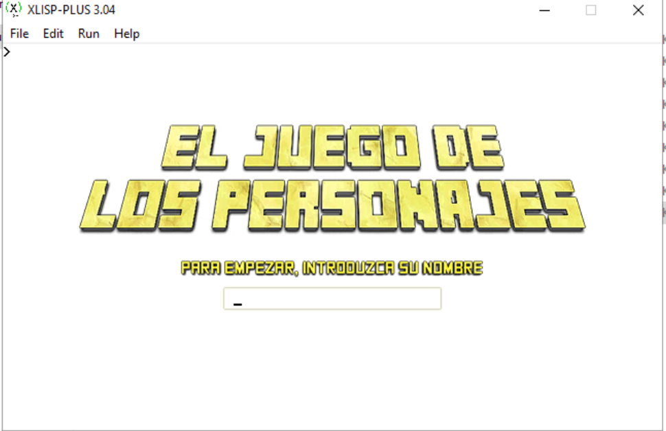
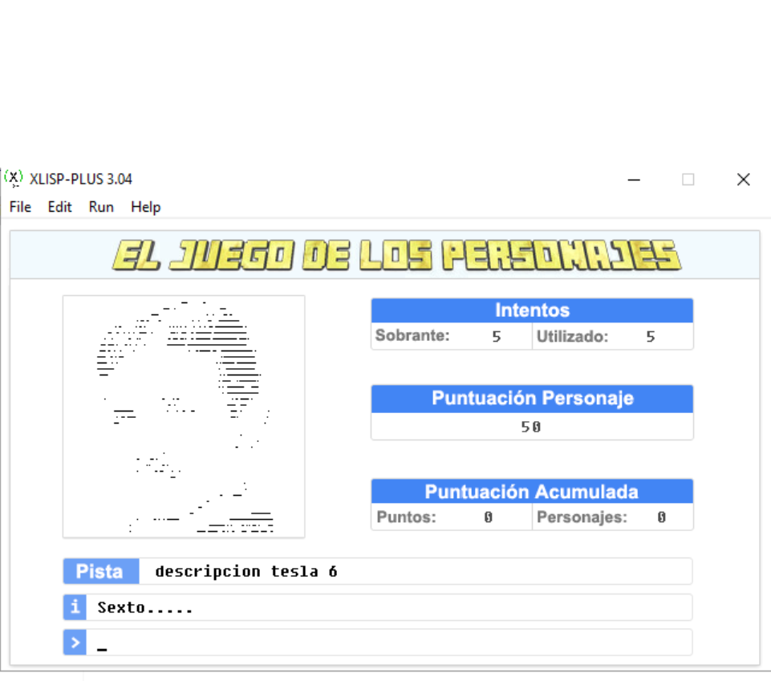
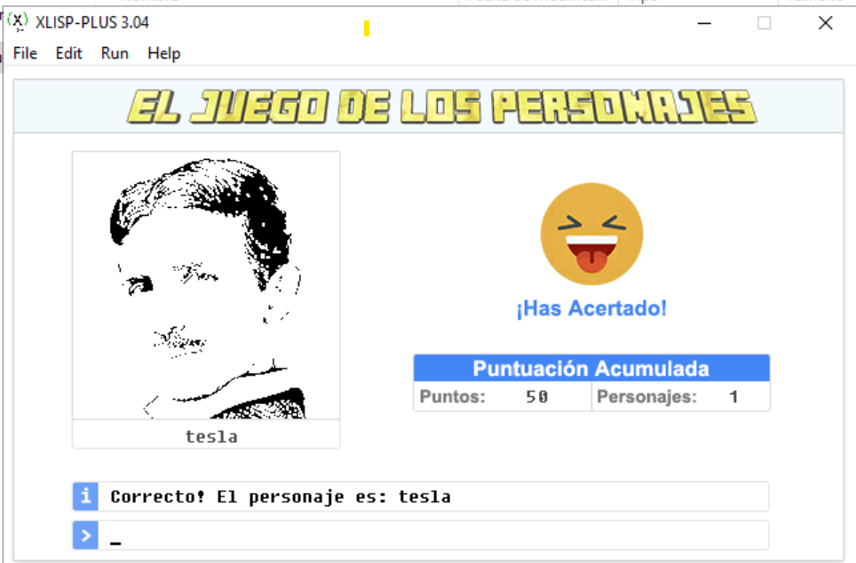
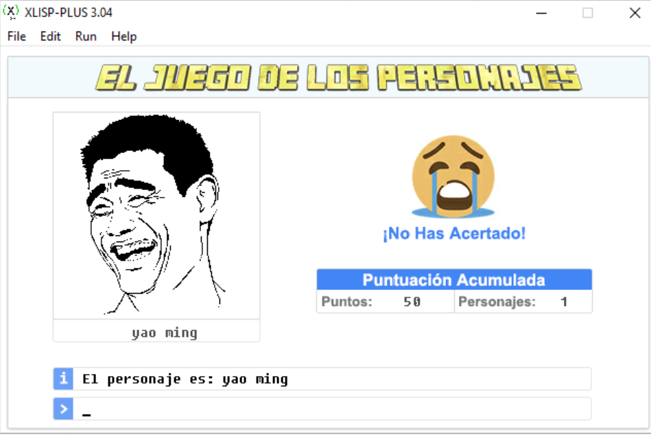

# Guess who i am
A simple game wrote with lisp

## How to play
- Execute xlwin32.exe
- Load file **PRACTICALISP.lsp**
- init the game with  **(inicio)** -> don't forget press enter XD
- type your name, and enjoy the game

## How i generate graphic for Lisp
I made a program with java which generate code to paint line by line and pixel by pixel of the image
